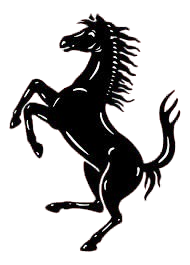

# 🏎️ Ferrari F1 - Cinematic Scrollytelling Experience

<div align="center">



**A premium, Awwwards-level cinematic scrollytelling website for Ferrari F1**

Built with Next.js 16, React 19, Framer Motion & TailwindCSS

</div>

---

## ✨ Overview

This project is a **high-performance, scroll-driven cinematic experience** showcasing Ferrari F1 engineering. The website features a stunning scroll-synced video animation that plays frame-by-frame as the user scrolls, creating an immersive, premium feel inspired by Apple-style product pages.

### 🎯 Key Features

- **Scroll-Driven Video Animation** - A 240-frame image sequence that plays smoothly based on scroll position
- **Smooth Spring Physics** - Custom-tuned Framer Motion spring animations for a high-end feel
- **Responsive Design** - Fully responsive across all devices and screen sizes
- **Dynamic Navbar** - Auto-hiding navbar that disappears after scrolling past the hero section
- **Loading Experience** - Beautiful loading screen with progress indicator
- **Premium Typography** - Custom Google Fonts (Bungee Outline, Inter) for striking visuals
- **Parallax Text Sections** - Animated text sections that reveal content as you scroll

---

## 🛠️ Tech Stack

| Technology | Version | Purpose |
|------------|---------|---------|
| **Next.js** | 16.1.4 | React Framework with App Router |
| **React** | 19.2.3 | UI Library |
| **TypeScript** | ^5 | Type Safety |
| **Framer Motion** | 12.29.0 | Animations & Scroll Tracking |
| **TailwindCSS** | ^4 | Utility-First Styling |
| **Lucide React** | 0.563.0 | Icon Library |

---

## 📁 Project Structure

```
my-app/
├── app/
│   ├── components/
│   │   ├── FerrariCanvas.tsx    # Main scroll-synced video/frame animation
│   │   ├── Navbar.tsx           # Auto-hiding navigation bar
│   │   └── TextSection.tsx      # Reusable animated text sections
│   ├── globals.css              # Global styles
│   ├── layout.tsx               # Root layout with metadata
│   └── page.tsx                 # Main landing page
├── public/
│   ├── ezgif-31b5d5c66398d782-jpg/  # 240 JPG frames for scroll animation
│   ├── ferrari-Logo.png         # Ferrari prancing horse logo
│   └── logo.png                 # Ferrari text logo
├── package.json
├── tailwind.config.ts
├── tsconfig.json
└── next.config.ts
```

---

## 🚀 Getting Started

### Prerequisites

- **Node.js** 18.x or higher
- **npm** or **yarn** package manager

### Installation

1. **Clone the repository**
   ```bash
   git clone <repository-url>
   cd my-app
   ```

2. **Install dependencies**
   ```bash
   npm install
   # or
   yarn install
   ```

3. **Run the development server**
   ```bash
   npm run dev
   # or
   yarn dev
   ```

4. **Open your browser**
   
   Navigate to [http://localhost:3000](http://localhost:3000) to view the website.

---

## 📜 Available Scripts

| Command | Description |
|---------|-------------|
| `npm run dev` | Starts the development server |
| `npm run build` | Creates an optimized production build |
| `npm run start` | Runs the production server |
| `npm run lint` | Runs ESLint for code quality |

---

## 🎬 How It Works

### Scroll-Driven Animation

The core experience is powered by the `FerrariCanvas` component which:

1. **Preloads 240 JPG frames** into memory on page load
2. **Tracks scroll position** using Framer Motion's `useScroll` hook
3. **Smooths scroll values** with spring physics (`stiffness: 45, damping: 15`)
4. **Maps scroll progress** to frame numbers (0-239)
5. **Renders frames** on a high-DPI canvas for crisp visuals

```typescript
// Simplified scroll-to-frame mapping
const maxScroll = window.innerHeight * 4;  // 500vh total scroll
const progress = latest / maxScroll;        // 0 to 1
const frameIndex = Math.floor(progress * FRAME_COUNT);
```

### Component Architecture

- **`FerrariCanvas`** - Handles image preloading, canvas rendering, and scroll-to-frame mapping
- **`Navbar`** - Uses `useMotionValueEvent` to hide/show based on scroll position
- **`TextSection`** - Wraps content with `whileInView` animations for reveal effects

---

## 🎨 Design System

### Colors

| Color | Hex | Usage |
|-------|-----|-------|
| Ferrari Red | `#9e0e0e` | Primary background |
| Dark Gray | `#1a202c` | Footer background |
| White | `#ffffff` | Primary text |

### Typography

- **Bungee Outline** - Hero "FERRARI" text
- **Inter** - Body text and UI elements

---

## 📱 Responsive Breakpoints

The design adapts seamlessly across screen sizes:

- **Mobile**: < 768px
- **Tablet**: 768px - 1024px
- **Desktop**: > 1024px

---

## ⚡ Performance Optimizations

- **Image Preloading** - All frames are preloaded before displaying content
- **High-DPI Canvas** - Uses `devicePixelRatio` for retina displays
- **Spring Smoothing** - Prevents janky animations during fast scrolling
- **RequestAnimationFrame** - Efficient frame rendering
- **CSS Filters** - Hardware-accelerated contrast/brightness enhancement

---

## 🤝 Contributing

1. Fork the repository
2. Create your feature branch (`git checkout -b feature/amazing-feature`)
3. Commit your changes (`git commit -m 'Add some amazing feature'`)
4. Push to the branch (`git push origin feature/amazing-feature`)
5. Open a Pull Request

---

## 📄 License

This project is for demonstration purposes. Ferrari branding and imagery are used for educational showcase only.

---

##  Acknowledgments

- **Ferrari** - For the iconic brand and inspiration
- **Framer Motion** - For powerful animation capabilities
- **Next.js Team** - For an incredible React framework
- **Awwwards** - For setting the standard in web design

---

<div align="center">

**Built with ❤️ and a passion for speed**

*© 2026 Ferrari F1 Experience*

</div>
